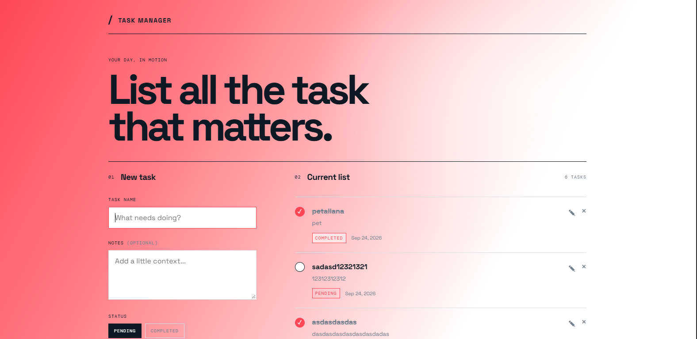
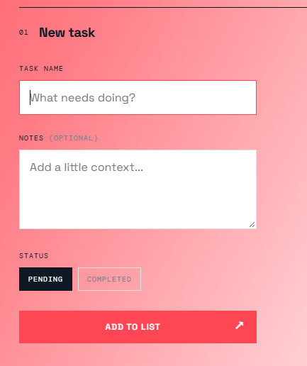
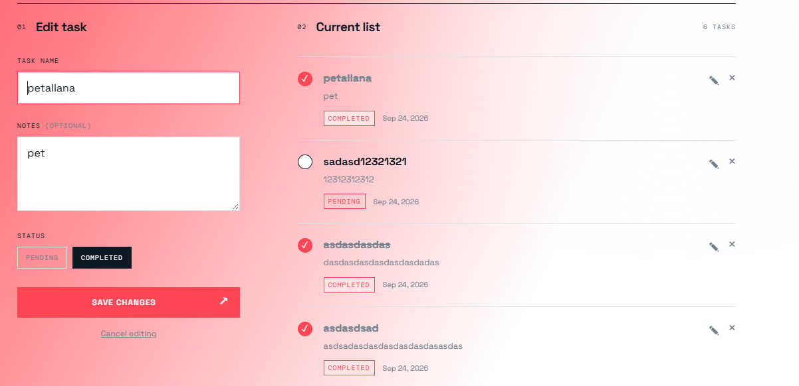
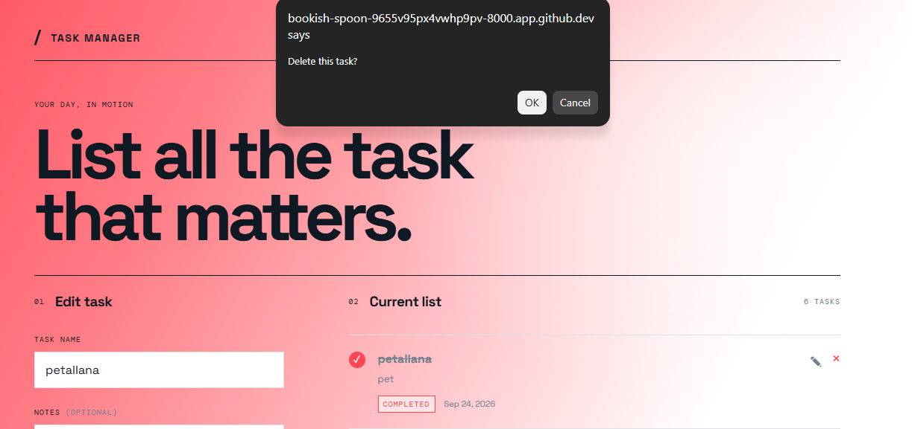

## Project Information

- Project Code: WST21-PM-2026-SF
- Student Name: Jeff Daniel C. Petallana
- Course & Year: BSIT-2
- Database Used: SQLite

## Features

- Add Task
- View Tasks
- Edit Task
- Delete Task
- Update Status

## Task Management Walkthrough

Follow the screenshots in order to create and manage tasks in Taskline.

### 1. Open the task workspace

Start the app and open the dashboard. The workspace shows the **New task** form alongside the **Current list**, where saved tasks appear.



### 2. Enter a task

In the **New task** form, enter a task name. Add optional notes for context, choose **Pending** or **Completed**, then select **Add to list** to save it.



### 3. Review the current list

After saving, find the task in **Current list**. Each task shows its name, any notes, its status, and its creation date.



### 4. Update a task

Use the check control on a task to switch it between pending and completed. Select the pencil control to edit its details, or the **×** control to delete it. The updated list is shown below.



## Run locally

```bash
composer install
npm install
php artisan migrate
npm run build
php artisan serve
```

Open `http://127.0.0.1:8000`. The dashboard supports adding, editing, deleting, and toggling tasks between pending and completed.